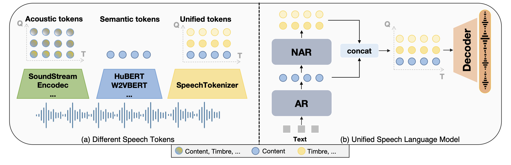
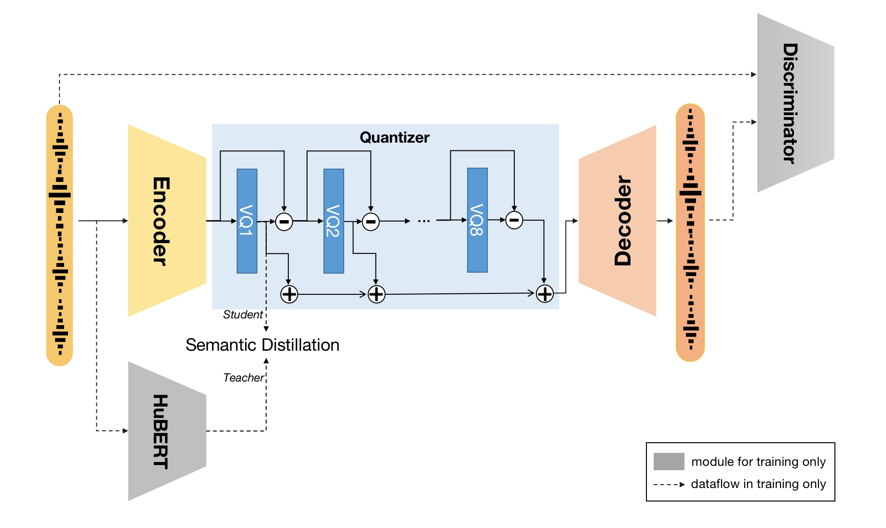

# SpeechTokenizer: Unified Speech Tokenizer for Speech Language Models

<a href='https://0nutation.github.io/SpeechTokenizer.github.io/'></a>  <a href='https://arxiv.org/abs/2308.16692'></a>

## Introduction
This is the code for the SpeechTokenizer presented in the [SpeechTokenizer: Unified Speech Tokenizer for Speech Language Models](https://arxiv.org/abs/2308.16692). SpeechTokenizer is a unified speech tokenizer for speech language models, which adopts the Encoder-Decoder architecture with residual vector quantization (RVQ). Unifying semantic and acoustic tokens, SpeechTokenizer disentangles different aspects of speech information hierarchically across different RVQ layers. Specifically, the code indices that the first quantizer of RVQ outputs can be considered as semantic tokens and the output of the remaining quantizers mainly contain timbre info, which serve as supplements for the information lost by the first quantizer. We provide our models:
* A model operated at 16khz on monophonic speech trained on Librispeech with average representation across all HuBERT layers as semantic teacher.

<br>
<p align="center">
     <br>
    Overview
</p>
<p align="center">
     <br>
    The SpeechTokenizer framework.
</p>
<br>


Welcome to try our [SLMTokBench](https://github.com/0nutation/SLMTokBench) 
 and we will also open source our  [USLM](https://github.com/0nutation/USLM) !!

## Release
- [9/11] 🔥 We released code of [soundstorm_speechtokenizer](https://github.com/ZhangXInFD/soundstorm-speechtokenizer).
- [9/10] 🔥 We released code and checkpoints of [USLM](https://github.com/0nutation/USLM). 
- [9/1] 🔥 We released code and checkpoints of SpeechTokenizer. Checkout the [paper](https://arxiv.org/abs/2308.16692) and [demo](https://0nutation.github.io/SpeechTokenizer.github.io/).

## Samples

Samples are provided on [our demo page](https://0nutation.github.io/SpeechTokenizer.github.io/).

## Installation

SpeechTokenizer requires Python>=3.8, and a reasonly recent version of PyTorch.
To install SpeechTokenizer, you can run from this repository:
```bash
pip install -U speechtokenizer

# or you can clone the repo and install locally
git clone https://github.com/ZhangXInFD/SpeechTokenizer.git
cd SpeechTokenizer
pip install .
```
## Usage
### Model storage
| Model| Dataset |Discription|
|:----|:----:|:----|
|[speechtokenizer_hubert_avg](https://huggingface.co/fnlp/SpeechTokenizer/tree/main/speechtokenizer_hubert_avg)|LibriSpeech|Adopt average representation across all HuBERT layers as semantic teacher |
### load model
```python
from speechtokenizer import SpeechTokenizer

config_path = '/path/config.json'
ckpt_path = '/path/SpeechTokenizer.pt'
model = SpeechTokenizer.load_from_checkpoint(config_path, ckpt_path)
model.eval()
```
### Extracting discrete representations
```python
import torchaudio
import torch

# Load and pre-process speech waveform
wav, sr = torchaudio.load('<SPEECH_FILE_PATH>')

# monophonic checking
if wav.shape(0) > 1:
    wav = wav[:1,;]

if sr != model.sample_rate:
    wav = torchaudio.functional.resample(wav, sr, model.sample_rate)

wav = wav.unsqueeze(0)

# Extract discrete codes from SpeechTokenizer
with torch.no_grad():
    codes = model.encode(wav) # codes: (n_q, B, T)

RVQ_1 = codes[:1, :, :] # Contain content info, can be considered as semantic tokens
RVQ_supplement = codes[1:, :, :] # Contain timbre info, complete info lost by the first quantizer
```

### Decoding discrete representations
```python
# Concatenating semantic tokens (RVQ_1) and supplementary timbre tokens and then decoding
wav = model.decode(torch.cat([RVQ_1, RVQ_supplement], axis=0))

# Decoding from RVQ-i:j tokens from the ith quantizers to the jth quantizers
wav = model.decode(codes[i: (j + 1)], st=i) 
```

## Citation
If you use this code or result in your paper, please cite our work as:
```Tex
@misc{zhang2023speechtokenizer,
      title={SpeechTokenizer: Unified Speech Tokenizer for Speech Language Models}, 
      author={Xin Zhang and Dong Zhang and Shimin Li and Yaqian Zhou and Xipeng Qiu},
      year={2023},
      eprint={2308.16692},
      archivePrefix={arXiv},
      primaryClass={cs.CL}
}
```
## License
The code in this repository is released under the Apache 2.0 license as found in the
[LICENSE](LICENSE) file.
